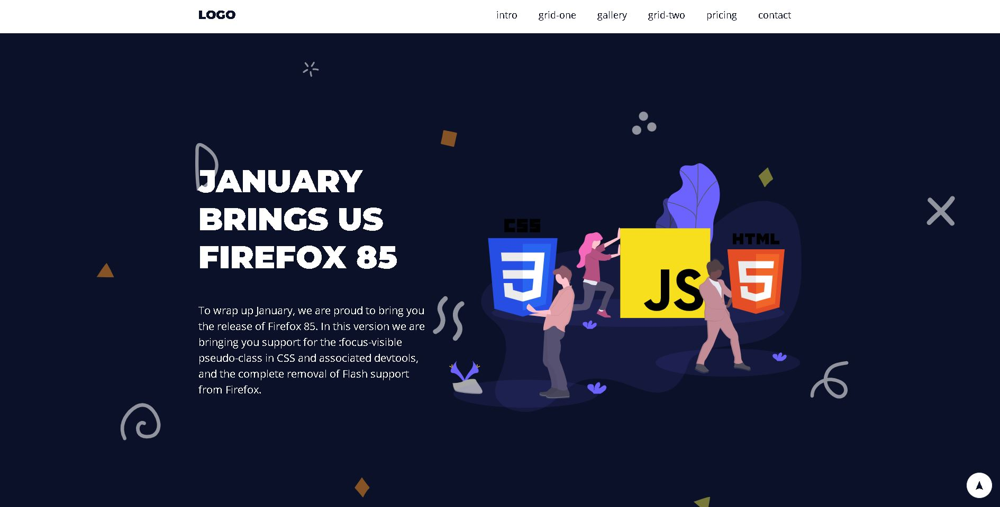
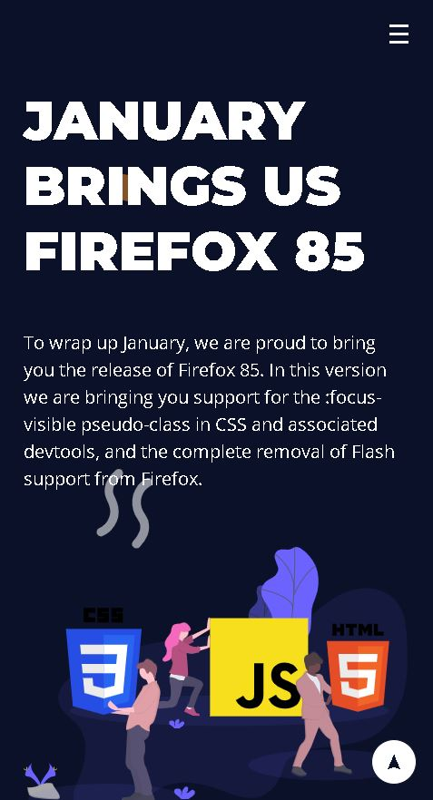

<h1 align="center"> Projeto Landing Page - HTML e CSS </h1>

Projeto de landing page criado com HTML e CSS no curso de HTML5 e CSS3 do Instrutor Luiz Otávio Miranda na Udemy.

<a href="#tecnologias">Tecnologias</a>&nbsp;&nbsp;&nbsp;|&nbsp;&nbsp;&nbsp;
<a href="#projeto">Projeto</a>

 

Imagem da parte superior da página (Imagem 1).

 

Imagem da parte superior da página adaptada para mobile (Imagem 2).

## Tecnologias

Esse projeto foi desenvolvido com as seguintes tecnologias:

- HTML e CSS
- Git e Github

## Projeto

O Projeto Landing Page consiste em uma página única, com menu de seleção, que ao clicar, desce até a seção selecionada. Em cada seção foi utilizada ferramentas com display flex, grid, além de formulários, tabelas, entre outros. A página também possui media queries para responsividade ao mobile.

---

Projeto realizado por Luiz Otávio Miranda e feito e adaptado por Victor Pimenta. [LinkedIn](https://www.linkedin.com/in/victor-cardoso-pimenta-0250371a0/)